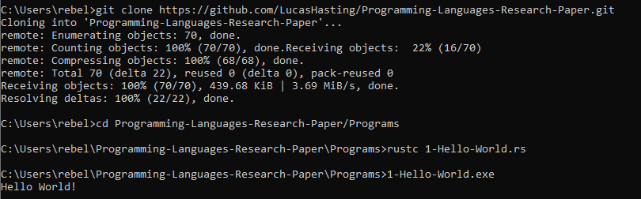

# Programming Languages Rust Research Paper

This repository holds my research paper on the Rust programming language and the programs associated with the paper. The paper can be viewed [here](https://github.com/LucasHasting/Programming-Languages-Research-Paper/blob/main/Paper/CS410W_Research_Paper.pdf). All program names consist of the figure number and the name of the figure it belongs to. Instructions for executing the programs in the repository are listed below.

## Table of Contents

- [Rust-Installation](#rust-installation)
- [Example](#example)
- [Important-Notice](#important-notice)

## Rust-Installation

The programs in this repository can be executed using the [Rust](https://www.rust-lang.org/tools/install) language and the rustc compiler.

### Option 1: using [git](https://git-scm.com/downloads)
1. Clone the repository:

    ```sh
    git clone https://github.com/LucasHasting/Programming-Languages-Research-Paper.git
    ```

2. Navigate to the project directory and execute the program:

    ```sh
    cd Programming-Languages-Research-Paper/Programs
    rustc program-name.rs
    ```
### Option 2: without git
1. Download the project as a zip file
2. [Extract the zip file](https://www.wikihow.com/Unzip-a-File)

#### Run from the command line
1. Find the location of the files
2. Copy the path
3. go to the command line and run the following:
   ```sh
   cd /path/to/files
   rustc program-name.rs
   ```

## Example



## Important-Notice
Programs 18-27 are for demonstration purposes on what Rust can and can not do safely, the programs may not run or may crash and are designed that way.
